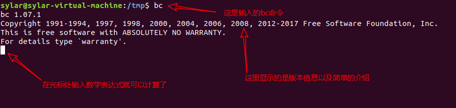
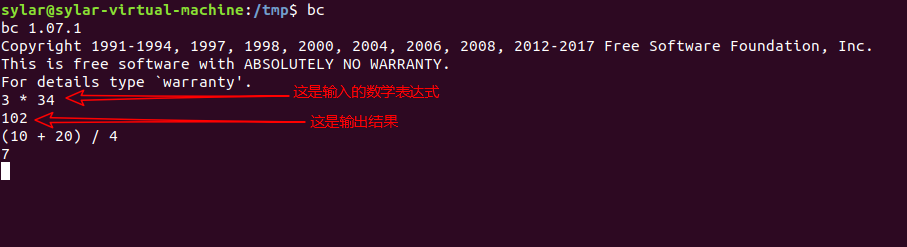
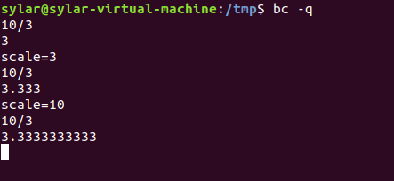
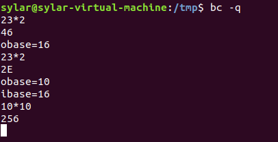
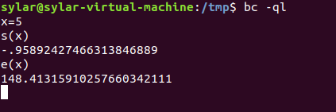

Shell数学计算
=============

如果要执行数学计算, 就离不开各种运算符号, 和其它编程语言类似, Shell也有很多算术运算符.

========================================   ===================================================
``+`` ``-``                                加法(或正好), 加法(或负号)
``*`` ``/`` ``%``                          乘法, 除法, 取余(取模)
``**``                                     幂运算
``++`` ``--``                              自增和自减, 可以放在变量的前面也可以放在变量的后面
``&&`` ``||`` ``!``                        逻辑与, 逻辑或, 逻辑非
``<`` ``<=`` ``>`` ``>=``                  比较符号
``==`` ``!=``                              比较符号
``<<`` ``>>``                              向左移位, 向右移位 
``~`` ``|`` ``&`` ``^``                    按位取反, 按位或, 按为与, 按位异或
``=`` ``+=`` ``-=`` ``*=`` ``/=`` ``%=``   赋值和复合赋值运算符
========================================   ===================================================

数学计算命令
------------

Shell和其它编程语言不同, \ **Shell不能直接进行算术运算, 必须使用数学计算命令**\ .

Shell中常用的六种数学计算方式:

============== ===========================================================
``(())``       用于整数运算, 效率很高, 推荐使用.
``let``        用于整数运算, 和\ ``(())``\ 类似.
``$[]``        用于整数运算, 不如\ ``(())`` 灵活.
``expr``       可用于整数运算, 也可以处理字符串. 

               比较麻烦, 需要注意各种细节, 不推荐使用.
``bc``         Linux下的一个计算器程序, 可以处理整数和小数运算.

               Shell本身只支持整数运算, 想计算小数就得使用\ ``bc``\ .
``declare -i`` 将变量定义整数, 然后在进行数学运算时就不会被当作字符串了.

               功能有限, 仅支持最基本的数学运算(加减乘除和取余).
============== ===========================================================

.. note::

    学习\ ``(())``\ 和\ ``bc``\ 即可: ``(())``\ 可以用于整数计算, ``bc``\ 可以用于小数计算.

Shell ``(())`` - 对整数进行数学运算
-----------------------------------

双小括号\ ``(())``\ 是Bash Shell中专门用来进行\ **整数运算**\ 的命令, 它的效率很高, 写法灵活.

.. attention::

    ``(())``\ 只能进行整数运算, 不能对小数或者字符串进行运算.

Shell ``(())``\ 的用法
^^^^^^^^^^^^^^^^^^^^^^

双小括号\ ``(())``\ 的语法格式为:

.. code-block:: sh
    :emphasize-lines: 1

    ((expressions))

通俗地讲, 就是将数学运算表达式放在\ ``((``\ 和\ ``))``\ 之间.

表达式可以只有一个, 也可以有多个, 多个表达式之间以逗号\ ``,``\ 分隔. 
对于多个表达式的情况, 以最后一个表达式的值作为整个\ ``(())``\ 命令的执行结果.

可以使用\ ``$``\ 获取\ ``(())``\ 命令的结果, 这和使用\ ``$``\ 获得变量的值是类似的.

``(())``\ 的用法举例:

+-------------------+-------------------------------------------------------------------------+
| ((a=10+66))       | 这种写法可以在计算完成后给变量赋值.                                     |
|                   |                                                                         |
| ((b=a-15))        | 以((b=a-15))为例, 即将a-15的运算结果赋值给变量c.                        |
|                   |                                                                         |
| ((c=a+b))         |                                                                         |
+-------------------+-------------------------------------------------------------------------+
| a=$((10+66))      | 可以在\ ``(()))``\ 前面加上\ ``$``\ 符号获取\ ``(())`` 命令的执行结果.  |
|                   |                                                                         |
| b=$((a-15))       | 以c=$((a+b))为例, 即将a+b这个表达式的运算结果赋值给变量c.               |
|                   |                                                                         |
| c=$((a+b))        | 以c=$((a+b))为例, 即将a+b这个表达式的运算结果赋值给便来嗯c.             |
+-------------------+-------------------------------------------------------------------------+
| ((a>7 && b==c))   | ``(())``\ 也可以进行逻辑运算, 在\ ``if``\ 语句中常会使用逻辑运算.       |
+-------------------+-------------------------------------------------------------------------+
| echo $((a+10))    | 需要立即输出表达式的运算结果时, 可以在\ ``(())``\ 前面加上\ ``$``\ 符号.|
+-------------------+-------------------------------------------------------------------------+
| ((a=3+5, b=a+10)) | 对多个表达式同时进行计算.                                               |
+-------------------+-------------------------------------------------------------------------+

在\ ``(())``\ 中使用变量无需要加上\ ``$``\ 前缀, ``(())``\ 会自动解析变量名, 这使得代码更加简洁.

Linux ``bc``\ 命令 - 一款数学计算器
-----------------------------------

Bash Shell内置了对整数运算的支持, 但是不支持浮点运算, 而Linux ``bc``\ 命令可以很方便的进行浮点运算, 当然整数运算也不在话下.

``bc``\ 设置可以称得上是一种编程语言了, 它支持变量, 数组, 输入输出, 分支结构, 循环结构, 函数等基本的编程元素, 
但是这里我们只是把它当成一个简单的计算器使用.

在终端输入\ ``bc``\ 命令, 然后回车即可进入\ ``bc``\ 进行交互式的数学计算. 
在Shell编程中, 也可以通过管道和输入重定向来使用\ ``bc``\ .

从终端进入\ ``bc``
^^^^^^^^^^^^^^^^^^

在终端输入\ ``bc``\ 命令, 然后回车, 就可以进入\ ``bc``\ .

可以执行\ ``bc -h/--help``\ 查看帮助信息.

在交互式环境下使用\ ``bc``
^^^^^^^^^^^^^^^^^^^^^^^^^^

使用\ ``bc``\ 进行数学计算是非常容易的, 想平常一样输入数学表达式, 然后按下回车就可以看到结果.

内置变量
********

``bc``\ 有四个内置变量, 我们在计算时经常会用到, 如下表所示:

========= ==========================================================
scale     指定精度, 也即小数点后的位数; 默认为0, 也即不是用小数部分.
ibase     指定输入的数字进制, 默认为十进制.
obasea    指定输出的数字进制, 默认为十进制.
last或者. 表示最近打印的数字.
========= ==========================================================

Example_1 - ``scale``\ 变量用法举例:

Example_2 - ``ibase``\ 和\ ``obase``\ 变量用法举例:

注意, ``obase``\ 要尽量放在\ ``ibase``\ 前面, 因为\ ``ibase``\ 设置后, 后面的数字都是以\ ``ibase``\ 的进制来计算的.
比如进行了如下的设置:

.. code-block:: 

    ibase=16
    obase=10

设置了\ ``ibase=16``\ 之后, 设置\ ``obase=10``\, 这里的数字\ ``10``\ 会被当作十六进制的是数字.

内置函数
********

出了内置变量, ``bc``\ 还有一些内置函数, 如下表所示:

========= ==============================
s(x)      计算x的正弦值, x是弧度值.
c(x)      计算x的余弦值, x是弧度值.
a(x)      计算x的反正切值, 返回弧度值.
l(x)      计算x的自然对数.
e(x)      求e的x次方.
j(n, x)   贝塞尔函数, 计算从n到x的阶数.
========= ==============================

要想使用这些数学函数, 在输入\ ``bc``\ 命令时需要使用\ ``-l``\ 选项, 表示启用数学库.

Example:

在一行中使用多个表达式
**********************

可以将多个表达式写在一行, 用分号\ ``;``\ 分隔.

在Shell中使用\ ``bc``\ 计算器
^^^^^^^^^^^^^^^^^^^^^^^^^^^^^

在Shell脚本中, 可以借助管道或者输入重定向来使用\ ``bc``\ 计算器.

    *   管道是Linux进程间的一种通信机制, 它可以将前一个命令(进程)的输出作为下一个命令(进程)的输入, 两个命令之间使用竖线\ ``|``\ 分隔;
    *   通常情况下, 一个命令从终端获得用户输入的内容, 如果让它从其它地方(比如文件)获得输入, 那么就需要重定向.

借助管道使用\ ``bc``\ 计算器
****************************

如果希望直接输出\ ``bc``\ 计算的结果, 可以使用下面的形式:

.. code-block:: sh
    
    echo "expression" | bc

``expression``\ 就是希望计算的数学表达式, 它必须符合\ ``bc``\ 的语法.

使用下面的形式可以将\ ``bc``\ 的计算结果赋值给Shell变量:

.. code-block:: sh

    variable=$(echo "expression" | bc)

``variable``\ 就是变量名.

Example:

.. code-block:: sh

    #!/usr/bin/env bash

    m=1E
    n=$(echo "obase=10; ibase=16; $m" | bc)
    echo $n

借助输入重定向使用\ ``bc``\ 计算器
**********************************

使用下面的形式将\ ``bc``\ 的计算结果赋值给Shell变量:

.. code-block:: bash

    variable=$(bc << EOF
    expressions
    EOF
    )

其中, ``variable``\ 是Shell变量名, ``expressions``\ 是要计算的数学表达式(可以换行, 和进入\ ``bc``\ 以后的书写形式一样), 
``EOF``\ 是数学表达式的开始和结束标识(也可以换成其它的名字, 比如aaa, bbb等).

Example:

.. code-block:: bash

    #!/usr/bin/env bash

    m=1E
    n=$(bc << EOF
    obase=10
    ibase=16
    print $m
    EOF
    )
    echo $n

如果有大量的数学计算, 那么使用输入重定向就比较方便, 因为数学表达式可以换行, 写起来更加清晰明了.

